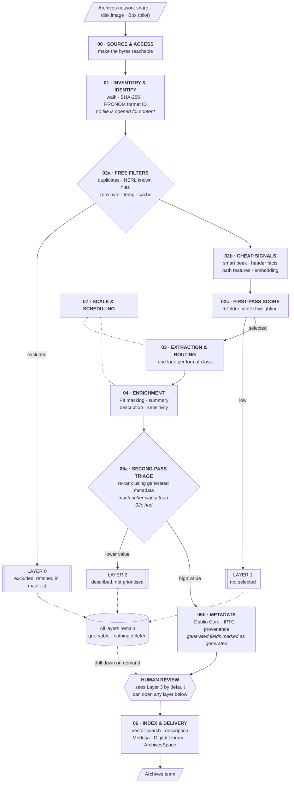

# RIMS Digital Archives — Unified Pipeline Design

**Draft v0.3** · Tayler Erbe · Status: working document, for discussion
**Revised 12 Aug 2026** against the Archives' answers — see
[`docs/stakeholders/answers-2026-08.md`](../stakeholders/answers-2026-08.md).

Changes from v0.2, all driven by those answers:

- **The problem statement changed.** We are not processing drives that arrive; we are
  unblocking a queue that already exists on a network share. §1 rewritten.
- **Scale is three orders of magnitude smaller than assumed** — 100–10,000 files per
  accession, ~49 accessions, not million-file drives. §2 and §3 rewritten.
- **§3 "Things we do not know" is now mostly things we do know.** Two of the four guesses are
  settled; one is narrowed; one remains.
- **Two accession types**, personal papers and administrative records, with different
  appraisal rules and different turnaround targets. Runs through §4 and §6.
- **Delivery is a three-way fork** — Medusa, the Library Digital Library, ArchivesSpace. §8.
- **Nothing-is-ever-deleted was wrong** as a description of the lifecycle. §6 and §10.
- Human oversight thresholds in §10 are **approved**, not proposed.

Changes from v0.1 (retained for the record): throughput figures replaced with measured
post-optimisation numbers; triage restructured as two passes with metadata generation between
them; smart text peek replaces the flat first-2KB approach; AI agent section added;
assumptions separated from measurements.

---

## 1. The problem

**The Archives has stated it plainly, and their wording is better than ours was.** Asked where
media lives once received, Joanne Kaczmarek described the existing process — Tracy Popp takes
content off the media, performs preservation processing, and lands it on a network drive, where:

> ...the archivists are supposed to review and make final appraisal decisions.
> **This is our bottleneck.**

That is the problem. Not acquisition — that works, and someone else owns it. The failure is
what happens *after* material lands on the share: **49 collections of personal papers are sitting
there now**, waiting for an appraisal decision nobody has capacity to make, plus an unquantified
email backlog and 12,000 images.

Material belonged to researchers who have retired or died. Somewhere in it is work worth
keeping, and there is no practical way to find it, because appraising it by hand means opening
all of it.

This system answers one question at scale: which of these files matter? Everything expensive
happens only after that question has an answer.

**What this reframing changes.** We are not building a front door — the Archives has one. We are
building the middle, and the middle is stages 02 (triage and appraisal) and 06 (index, search
and delivery). Stage 00 shrinks to obtaining read access on a share. Parts of stage 01 may
already be done by Tracy's preservation processing and should be checked before being rebuilt.

Success has two measures, and the Archives ordered them explicitly (answer 8.1): clearing the
backlog first, but **long-term, researchers being able to find things is the primary goal.**
Stage 06 is therefore not a trailing nice-to-have.

---

## 2. Throughput — measured, not estimated

The v0.1 draft of this document quoted unoptimised figures. Those numbers were the starting
point of two separate performance investigations, not the current state, and using them
overstates the problem considerably. Corrected:

### Image classification — measured on our L4

| Configuration | Throughput | Per image | 12,125-image corpus |
|---|---|---|---|
| Ollama, `llava-llama3` Q4_0 (original) | 9.1 img/min | 6.6 s | 22.2 hrs |
| Ollama, `llava:7b` Q4_0 | 15.3 img/min | 3.9 s | 13.1 hrs |
| **vLLM, `llava-1.5-7b` FP16, C=8** | **55.4 img/min** | **1.08 s** | **3.7 hrs** |

6.22× end-to-end speedup on identical hardware. 3.6× of that is purely the serving stack —
Ollama was serialising requests and holding the L4 at 28–31% utilisation while vLLM's
continuous batching runs it at 96–97%. The remaining 1.7× is model fit.

Full method and results: `archival-image-throughput-evaluation.html`

### Text extraction and summarisation — measured on our L4

| Configuration | Throughput | Per document |
|---|---|---|
| Ollama CLI via `subprocess`, per-row (POC 1 baseline) | ~0.03 rows/sec | 34.8 s |
| **vLLM, Llama 3.1 8B AWQ, chunk 1200, C=24** | **0.88 chunks/sec** | **~2.7 s** |

The 34.8 s/row figure from the email POC is real but it is an artefact of calling the Ollama
CLI once per row, which reloads model weights on every call. It should not be used to size
anything. The vLLM figure assumes 2.40 chunks per document, which is what the Illinois
legislation corpus measured; document length here will differ.

Full method and results: `vllm-inference-throughput-evaluation.html`

### What this means for the architecture — **substantially revised in v0.3**

v0.2 sized this against a hypothetical 100,000-file drive. The real numbers are much smaller.

Answer 1.7: **100 to 10,000 files per accession.** Answer 1.4: **49 collections** in the
personal-papers backlog. At ~3,000 files average that is roughly **150,000 files in total** —
not per drive, in the entire backlog.

Answer 8.2: acceptable turnaround is **3–6 months** for personal papers and **≤3 months** for
administrative records.

Put those together and there is no throughput problem. At ~2.7 s/document on optimised serving,
the whole personal-papers backlog is on the order of days of GPU time even with no triage at all.

**So the speed argument for triage is dead, and that is fine, because it was never the real
argument.** The real one is unchanged and now carries the whole case:

> **Most of what is on these drives should not be described at all.** System files, duplicates,
> caches, installers, and material with no archival value. Generating rich metadata for those is
> not just slow — it pollutes the finding aid.

Answer 3.3 confirms this from the Archives' side: system operations material, installed
applications, personal finance and commercial entertainment are all named as routinely
disposable. Describing them would actively make the catalogue worse.

**The design consequence of having no scale pressure.** Every choice between *faster* and *more
accurate, more auditable, more human-checked* should now go the second way. Cheap-deterministic-
first stays, because it keeps inference cost down and keeps junk out of the description — not
because we need it to survive the volume.

---

## 3. What we know now, and what is still open

Rewritten in v0.3. Two of the four v0.2 guesses are settled, one is narrowed, one stands.

### Settled

| Was | Now |
|---|---|
| "Drives contain 10,000 to millions of files" — guess | **100–10,000 files per accession**, ~49 accessions (answers 1.7, 1.4) |
| "Format mix resembles the file-search POC corpus" — unlikely | **Confirmed by the Archives**: `.xls .doc .pdf .txt .csv .mov .jpg .mp4 .eml .pst` (answer 1.7) |

The format list is the extraction routing table, given to us. Note `.eml` and `.pst` in it:
**email arrives inside personal-papers accessions**, not as a separate corpus later.

### Narrowed

| Assumption | Status |
|---|---|
| 40–70% falls out at zero cost | **Still untested, and harder to test than we thought.** Box extracts contain no OS files, and per answer 1.2 the network-share material has *also* been through preservation processing. Both corpora are pre-filtered, so both will understate this badly. A low number measured on either is evidence about the corpus, not about the architecture. |

### Still open

| Assumption | Status | What would settle it |
|---|---|---|
| Triage retains ~2% | **Guess.** Sizing examples only | Run stages 01–02 on real share material |
| **Total bytes** | **Unknown.** File counts are settled; size is not. `.mov` and `.mp4` are in the confirmed format list, so 10,000 files could be 2 GB or 800 GB | One `du -sh` on the share |
| What Tracy Popp's preservation processing produces | **Unknown, and it may overlap stage 01** | A conversation. Highest-value open item in the project |

The v0.2 line — "a directory listing of one drive answers three of these four and costs nothing"
— is still true and still unfulfilled, but it is now cheaper: with read access to the share we
generate it ourselves rather than asking anyone to produce it.

---

## 4. Architecture

The significant change from v0.1: triage is **two passes with metadata generation between
them**, not one pass.

The first pass is cheap and works on signals available without opening files properly. It
narrows the set to something manageable. Metadata generation then runs on what survives — and
that generated metadata is far richer than anything the first pass had. The second pass uses
it to rank importance properly. The reviewer sees only the final layer, but can drill back
into any earlier one.

Nothing is deleted at any point. Each pass adds a layer of context rather than removing
files.



### Why the second pass matters

The first pass is working with a filename, a path, a format identifier, and a few kilobytes
of text. That is enough to separate a research folder from a browser cache. It is not enough
to tell an important grant proposal from a routine one.

After enrichment we have a summary, an inferred document type, extracted entities, sensitivity
flags, and — critically — the same information for every sibling file in the folder. Ranking
importance with that is a genuinely different problem from ranking it with a filename.

This also means the expensive step earns its cost twice: once by producing the description we
need for the finding aid, and once by producing the signal that makes the second triage
possible.

### Two accession types, not one — **new in v0.3**

Answers 3.2, 3.3 and 8.2 make this unavoidable. **Personal papers and administrative records are
different systems**, and one averaged ruleset would be wrong for both.

| | Personal papers | Administrative records |
|---|---|---|
| Always keep | Correspondence, grant applications and reports, books and articles, committee and board material, courses taught | Dean/Director communications, annual reports, task force reports, minutes and agendas, budgets, enrolment statistics, curriculum change drafts and finals |
| Nearly always discard | OS and application files, installers, personal finance, commercial entertainment | Accounting detail — purchases, payroll, timesheets |
| Sensitive — **never auto-discard** | Personal finance, family correspondence | HR: FMLA, discipline matters, personnel discussions |
| Drafts | **Depends on discipline** — discardable for a scientist, valuable for a humanities scholar | Keep, drafts and finals |
| Turnaround target | 3–6 months | ≤ 3 months |

Two things follow that were not in v0.2.

**`accession_type` is set at ingest and triage branches on it.** Manifest schema v1.1 carries it.

**The accession profile is a rule selector, not just model context.** Because drafts are junk for
one discipline and the most valuable material for another, `profile_field` on the accession
record *chooses which ruleset applies*. That is a branch in the code, not a hint in a prompt.
Joanne confirmed profiles can be produced (answer 3.1).

### Discardable and sensitive are different dispositions — **new in v0.3**

Answer 3.3 lists HR material — FMLA, discipline matters, personnel discussions — as **both**
routinely discardable **and** sensitive. Collapsing those would let the system route personnel
files onto the discard pile on a rule match with no human ever seeing them.

So `s02_decision` has four values, not two, and **a sensitivity match hard-beats a discard
match** — encoded as precedence in the ruleset, not as a scoring weight:

| Value | Next |
|---|---|
| `selected` | Continues to enrichment |
| `not_selected` | Layer 1, subject to the retention clock |
| `discard_candidate` | Layer 0, sampled review, then the clock |
| `restricted_review` | **Supervising archivist, always. Never auto-discarded** |

This is a change we made on the Archives' behalf and it should be put to them explicitly.

---

## 5. Smart text peek

A flat "first 2 KB" is not enough, and it fails in a specific way: documents that begin with
letterhead, cover pages, boilerplate, or a blank scanned page all look identical in their
first 2 KB. On institutional material that is a large fraction of everything.

### The approach

Budget roughly 6 KB of text per file, sampled structurally rather than sequentially:

| Slice | Budget | Why |
|---|---|---|
| **Head, after skipping front matter** | 2 KB | Title, abstract, opening. Skip leading blank or boilerplate pages — take the first page carrying real text, not page 1. |
| **Tail** | 1 KB | Conclusions, signatures, references, sign-off. Often the most identifying part of a document. |
| **Strided middle** | 3 × 500 B | Three samples at even intervals through the body. Catches actual subject matter rather than framing. |
| **Structural signals** | ~1 KB | Headings, table-of-contents entries, sheet names, slide titles. Cheap to extract and unusually informative. |

Plus, at no text cost: filename, folder path, sibling filenames, page or sheet count, format,
and file size.

### Two refinements worth doing

**Extract keywords rather than embedding raw text.** Boilerplate dominates raw peek text —
letterheads, disclaimers, headers repeated on every page. Running a cheap keyword extraction
(YAKE, RAKE, or TF-IDF against a background corpus) over the peek and embedding *that* gives
a much cleaner signal for the same cost.

**Make it an escalation ladder, not a fixed budget.** Most files resolve at the first tier.
Only escalate the ones that don't:

| Tier | Budget | Applies to |
|---|---|---|
| 0 | Filename + path + format only | Files where that is decisive — system files, obvious media, known patterns |
| 1 | 6 KB structured peek | The default |
| 2 | 25 KB, denser sampling | Files that score ambiguously at tier 1 |
| 3 | Full extraction | Rare — only where tier 2 is still ambiguous and the file looks potentially significant |

### Format-specific notes

- **PDF:** sample by page, not by byte. Skip pages with no text layer at this stage; flag for
  OCR rather than paying for OCR during triage.
- **Spreadsheets:** sheet names and column headers are worth more than cell contents. Take
  those plus a few rows.
- **Presentations:** slide titles alone are often sufficient.
- **Email:** headers plus first message body. Do not walk the whole thread during triage.
- **Scientific, geospatial, 3D:** no text peek at all — read the header. Variable names,
  units, coordinate system, extent, instrument, and time range come out in milliseconds and
  are better than any text sample. This should be a first-class path.
- **Code and notebooks:** docstrings, markdown cells, imports, function names.

---

## 6. Scoring and folder weighting

Folder membership carries real signal. If seven of ten files in a folder score as clearly
significant, the other three are probably part of the same body of work — a supporting
spreadsheet, a draft, a figure — and should be weighted up rather than dropped.

The mechanism:

1. Score each file on its own signals.
2. Aggregate to folder level — mean score, score distribution, coherence of the child
   embeddings, folder name, presence of a README or documentation file.
3. Propagate back down as a weight. A weak file in a strong, coherent folder gets promoted.
   A strong-looking file in an obvious junk folder gets demoted.
4. Record the folder weight and the pre-weight score separately, so a reviewer can see *why*
   a file was promoted.

That last point matters. "Included because it sits in a folder that is 70% significant" is an
auditable reason. A single blended number is not.

### Two rules

**Optimise for recall, not precision.** Wrongly dropping a unique research record is
unrecoverable. Wrongly promoting a junk file costs a couple of seconds of GPU time. Set
thresholds to over-include deliberately.

**Never delete autonomously — corrected in v0.3.** v0.2 said "never delete" flat, and treated
that as a description of the archival lifecycle. It is not. Answer 5.7:

> ...once we have COMPLETED the selection stage of accessioning, everything else should be
> deleted. If there is a chance we need more time to decide on selection decisions, we will want
> a clear time period for when that content needs to be acted on. **This has been one of our
> challenges as we didn't set such a time period when the backlog content we have was originally
> brought in.**

The Archives disposes of material deliberately after selection, and answer 6.4 confirms nothing
externally prevents it. The safety property belongs to *the software's autonomous behaviour*, not
to the lifecycle. So:

- Each pass writes a layer, not a deletion. Layers 0–2 stay in the manifest and stay queryable.
- **The pipeline never deletes on its own.** Unchanged, non-negotiable.
- It **does** provide a deletion action: batched, approved by the accession archivist, recorded
  with who and when.
- **Unselected material gets a clock**, starting when selection completes — not at ingest.
  Joanne identified the absence of that clock as what created the existing backlog, so building
  it in addresses the cause rather than the symptom.
- **`restricted_review` material is never auto-proposed for disposal.**
- **The manifest row survives deletion of the content** — path, hash, size, dates, decision and
  rationale retained. That is the audit trail; destroying it would make disposal unaccountable.

---

## 7. AI agents — where they fit and where they don't

Worth being explicit, because this comes up and the answer differs sharply depending on what
we mean by "agent."

### Not viable: agents processing archive content through hosted services

These drives contain personal email, unreviewed PII, medical and tax records, and student
records covered by FERPA. Sending that content to Copilot, Azure OpenAI, or any hosted API is
not something we can justify, and the architecture should not depend on it being approved.

This is a design constraint rather than a preference, and it has an advantage: local
open-weight models need no approval, have no per-token cost, and remove an entire category of
risk from the project. Treat the hosted-service question as closed unless Data Privacy says
otherwise in writing.

### Viable and valuable: agents for building the pipeline

Claude Code, Copilot, and similar tools helping us write, debug, and refactor the pipeline
involve no archive content at all. That is a straightforward productivity gain and there is no
reason not to use it. Gauri should be using AI assistance for setup and debugging — I've put a
prompt template in the onboarding doc.

### Viable with caveats: local agentic loops on our own hardware

Open-weight models with tool-calling, running on the L4, orchestrated with something like
LangGraph or a plain Python loop. Nothing leaves our infrastructure. Genuinely useful for:

- **Folder and collection-level synthesis** — an agent that looks at a folder's file
  summaries, decides it needs more detail on three of them, fetches it, and writes a
  scope-and-content note.
- **Routing decisions on hard cases** — a file that failed extraction three different ways;
  an agent can try alternatives and record what worked.
- **Building and refining the routing config** — an agent that proposes format-handling rules
  based on what it sees failing, for us to review.

**The caveat that matters:** an agentic loop costs many model calls per item, where a single
classification is one call. At file scale that is the difference between hours and weeks.
Agents belong at the **folder and collection level**, where there are thousands of decisions,
not the **file level**, where there are millions.

That is the useful framing: agents for synthesis and exception handling, single calls for
volume work.

---

## 8. The manifest

One row per file, columns accumulating as it moves through stages. Partitioned Parquet.

This gives resumability for free — which stage a file has reached is visible from which
columns are populated — and it means every stage has the same interface: manifest in,
manifest out, enriched.

**Status: v1.1 drafted, not yet frozen.** [`manifest-schema.md`](manifest-schema.md).

v1.0 keyed `file_uid` to `source_id`, assuming the Box folder prefixes were accession numbers.
They are **record series numbers**, and they are not unique per delivery — two accessions from
the same office share one — so that key would have collided silently. v1.1 introduces
`accession_uid`, a delivery-scoped key. Caught before freeze, so the migration cost was zero.

Not freezing until the PII mapping store question is answered: it determines whether
`s04_pii_map_ref` is a path, a URI, or a key into an access-controlled store, which is a type
decision. Change history: [`schema-changelog.md`](schema-changelog.md).

---

## 9. Portability constraint

The file-search POC depends on `win32com.client` COM automation for `.doc`, `.xls` and `.ppt`
extraction. It launches actual Word, Excel and PowerPoint and drives them.

That will not run in Colab and will not run on the Linux server with the L4. It also cannot be
parallelised safely and it hangs on malformed files.

| Current | Replacement |
|---|---|
| `win32com` Office automation | Apache Tika, with LibreOffice headless for legacy formats |
| Per-format Python parsers | Apache Tika |
| Manual EXIF handling | ExifTool |
| Extension-based routing | Siegfried / DROID PRONOM identification |

This is a prerequisite for the unified pipeline, not a cleanup task.

---

## 10. Human oversight

**Approved by Joanne unchanged, 12 Aug 2026** (answer 6.3). These are configured defaults, not a
proposal — parameters in `src/schema/oversight.py`, not constants.

| Situation | Oversight |
|---|---|
| Anything flagged sensitive | Full human review, always. Never auto-decided |
| Discard decisions, first accession | Full review — the first accession is calibration, not production |
| Discard decisions, later accessions | Stratified sample 5–10%, plus everything in the borderline band |
| Auto-selected material | Stratified audit sample 5–10% |
| Deleting anything | Explicit human approval, batch level, recorded |

The reviewer sees Layer 3 by default. Layers 0 through 2 remain queryable so they can drill
down when something looks like it's missing. `restricted_review` items bypass layer assignment
entirely and route to the supervising archivist regardless of score.

### Two reviewers, not one — new in v0.3

- **Accessioning archivist** — general appraisal; pulls in subject-matter experts as needed
  (answer 3.4). Also holds deletion authority for their own accession (answer 6.5).
- **Supervising archivist** — reviews flagged sensitive content (answer 6.2).

Different people, different queues, different authority. Schema v1.1 carries `rv_role`.

### Review capacity is still unknown

Joanne could not give a number — arrival is irregular, and she reasonably asked what kind of
review we meant (answer 6.1). Re-asking in concrete units: *if the system handed you 200 flagged
documents, each with a one-line summary and a suggested disposition, is that an hour, a day, or a
week?* Until we have that, thresholds are set from the table above and tuned later.

One assumption of hers to correct: she has been assuming review means documents. Per answer 1.7
it spans documents, images **and** email.

---

## 11. Where the output goes — **new in v0.3**

v0.2 had no delivery architecture beyond "finding aids." Answer 5.4 and Joanne's covering email
give one, and it is a **three-way fork**, not a single destination.

```
                ┌──→  Medusa (or its replacement)   preservation copies, all retained material
   Stage 06 ────┤
                ├──→  Library Digital Library       access copies, unrestricted material only
                │
                └──→  ArchivesSpace                 description + links out to the above
```

Four things follow.

**IDEALS is out.** That was our assumption and it was wrong.

**ArchivesSpace was not on our list at all.** It is the Archives' incoming searchable database.
Joanne's model is links *from* ArchivesSpace *out* to files stored elsewhere — which also answers
the item-level description question in practice: item records are not pushed into the finding
aid, they are linked from it.

**Medusa is being replaced**, likely by a commercial product, as part of a Library digital
strategies exercise. Building tightly to its current ingest format is building to something with
a known expiry. **The pipeline should emit a repository-neutral package with a thin per-
destination adapter** — cheap now, saves a rebuild later.

**Access levels are `open` and `restricted`.** Two values (answer 7.3). Not three. Use the
Archives' vocabulary rather than inventing gradations they do not have.

Still open: whether email gets a different access model entirely. Joanne is considering a
stand-alone Archives workstation for email access rather than catalogue links, and is unsure
whether that should be a searchable index or a browsing interface. That is a real fork in this
stage.

---

## 12. Open questions

Live list with owners: [`docs/stakeholders/open-questions.md`](../stakeholders/open-questions.md).
Everything answered so far: [`answers-2026-08.md`](../stakeholders/answers-2026-08.md).

Blocking work right now:

1. **Read access to the Archives network share** — replaces the old "remote access to a real
   drive" ask, which was solving the wrong problem
2. **What Tracy Popp's preservation processing produces** — may remove work from stage 01
   rather than add to it
3. **Where the PII mapping store lives** — Brent, unanswered, blocks stage 04 and blocks
   freezing the manifest schema
4. **A labelled sample** — 50 files, two archivists independently. We can now draft the ruleset
   from answers 3.2 and 3.3 first, which makes this a check rather than a blank-page request
5. **Archives review capacity**, re-asked in concrete units

No longer blocking, resolved 12 Aug: which software the University licenses (answer 4.1);
accession numbering (2.1–2.3); oversight thresholds (6.3); access levels (7.3); retention
obligations (6.4, 5.7); clearance to see unredacted content (7.5).

Data Privacy sign-off on local model processing is not re-litigated — it was granted for the
POCs and the position has not changed.
