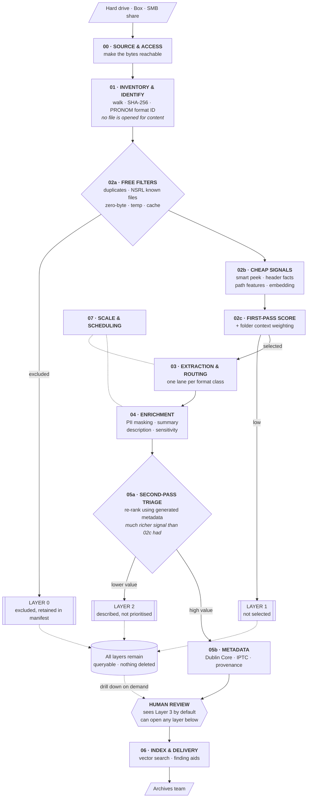

# RIMS Digital Archives — Unified Pipeline Design

**Draft v0.2** · Tayler Erbe · Status: working document, for discussion

Changes from v0.1: throughput figures replaced with measured post-optimisation numbers;
triage restructured as two passes with metadata generation between them; smart text peek
replaces the flat first-2KB approach; AI agent section added; assumptions separated from
measurements.

---

## 1. The problem

A drive arrives. It belonged to a researcher who has retired or died. Somewhere in it is work
worth keeping, and there is no practical way to find it, because appraising it by hand means
opening all of it.

This system answers one question at scale: which of these files matter? Everything expensive
happens only after that question has an answer.

---

## 2. Throughput — measured, not estimated

The v0.1 draft of this document quoted unoptimised figures. Those numbers were the starting
point of two separate performance investigations, not the current state, and using them
overstates the problem considerably. Corrected:

### Image classification — measured on our L4

| Configuration | Throughput | Per image | 12,125-image corpus |
|---|---|---|---|
| Ollama, `llava-llama3` Q4_0 (original) | 9.1 img/min | 6.6 s | 22.2 hrs |
| Ollama, `llava:7b` Q4_0 | 15.3 img/min | 3.9 s | 13.1 hrs |
| **vLLM, `llava-1.5-7b` FP16, C=8** | **55.4 img/min** | **1.08 s** | **3.7 hrs** |

6.22× end-to-end speedup on identical hardware. 3.6× of that is purely the serving stack —
Ollama was serialising requests and holding the L4 at 28–31% utilisation while vLLM's
continuous batching runs it at 96–97%. The remaining 1.7× is model fit.

Full method and results: `archival-image-throughput-evaluation.html`

### Text extraction and summarisation — measured on our L4

| Configuration | Throughput | Per document |
|---|---|---|
| Ollama CLI via `subprocess`, per-row (POC 1 baseline) | ~0.03 rows/sec | 34.8 s |
| **vLLM, Llama 3.1 8B AWQ, chunk 1200, C=24** | **0.88 chunks/sec** | **~2.7 s** |

The 34.8 s/row figure from the email POC is real but it is an artefact of calling the Ollama
CLI once per row, which reloads model weights on every call. It should not be used to size
anything. The vLLM figure assumes 2.40 chunks per document, which is what the Illinois
legislation corpus measured; document length here will differ.

Full method and results: `vllm-inference-throughput-evaluation.html`

### What this means for the architecture

Triage still comes first, but the argument is now about proportion rather than impossibility.
At roughly 1 second per image and 2.7 seconds per document on optimised serving, a 100,000
file drive is on the order of a few days if we process everything, and hours if we triage
first. Both are survivable; one is obviously better, and the gap widens with every drive.

The stronger argument for triage is not speed. It is that **most of what is on these drives
should not be described at all** — system files, duplicates, caches, and material with no
archival value. Generating rich metadata for those is not just slow, it pollutes the finding
aid.

---

## 3. Things we do not know

Flagging these explicitly so they don't get read as findings.

| Assumption | Status | What would settle it |
|---|---|---|
| Triage retains ~2% of a drive | **Guess.** Used in sizing examples only. | Run stages 01–02 on one real drive |
| Drives contain 10,000 to millions of files | **Guess.** No real drive has been measured. | A directory listing of one representative drive |
| 40–70% of a drive falls out at zero cost (duplicates, system files, junk) | **Plausible but untested** — typical of personal drives generally, not measured here | Same |
| Format mix resembles the file-search POC corpus | **Unlikely.** That corpus came from Box, not a researcher's drive. Stakeholders mention ArcGIS and 3D imaging work we have never seen. | Same |

A directory listing of one drive answers three of these four and costs nothing to produce. It
is the cheapest thing we can ask for.

---

## 4. Architecture

The significant change from v0.1: triage is **two passes with metadata generation between
them**, not one pass.

The first pass is cheap and works on signals available without opening files properly. It
narrows the set to something manageable. Metadata generation then runs on what survives — and
that generated metadata is far richer than anything the first pass had. The second pass uses
it to rank importance properly. The reviewer sees only the final layer, but can drill back
into any earlier one.

Nothing is deleted at any point. Each pass adds a layer of context rather than removing
files.

### Why the second pass matters

The first pass is working with a filename, a path, a format identifier, and a few kilobytes
of text. That is enough to separate a research folder from a browser cache. It is not enough
to tell an important grant proposal from a routine one.

After enrichment we have a summary, an inferred document type, extracted entities, sensitivity
flags, and — critically — the same information for every sibling file in the folder. Ranking
importance with that is a genuinely different problem from ranking it with a filename.

This also means the expensive step earns its cost twice: once by producing the description we
need for the finding aid, and once by producing the signal that makes the second triage
possible.

---

## 5. Smart text peek

A flat "first 2 KB" is not enough, and it fails in a specific way: documents that begin with
letterhead, cover pages, boilerplate, or a blank scanned page all look identical in their
first 2 KB. On institutional material that is a large fraction of everything.

### The approach

Budget roughly 6 KB of text per file, sampled structurally rather than sequentially:

| Slice | Budget | Why |
|---|---|---|
| **Head, after skipping front matter** | 2 KB | Title, abstract, opening. Skip leading blank or boilerplate pages — take the first page carrying real text, not page 1. |
| **Tail** | 1 KB | Conclusions, signatures, references, sign-off. Often the most identifying part of a document. |
| **Strided middle** | 3 × 500 B | Three samples at even intervals through the body. Catches actual subject matter rather than framing. |
| **Structural signals** | ~1 KB | Headings, table-of-contents entries, sheet names, slide titles. Cheap to extract and unusually informative. |

Plus, at no text cost: filename, folder path, sibling filenames, page or sheet count, format,
and file size.

### Two refinements worth doing

**Extract keywords rather than embedding raw text.** Boilerplate dominates raw peek text —
letterheads, disclaimers, headers repeated on every page. Running a cheap keyword extraction
(YAKE, RAKE, or TF-IDF against a background corpus) over the peek and embedding *that* gives
a much cleaner signal for the same cost.

**Make it an escalation ladder, not a fixed budget.** Most files resolve at the first tier.
Only escalate the ones that don't:

| Tier | Budget | Applies to |
|---|---|---|
| 0 | Filename + path + format only | Files where that is decisive — system files, obvious media, known patterns |
| 1 | 6 KB structured peek | The default |
| 2 | 25 KB, denser sampling | Files that score ambiguously at tier 1 |
| 3 | Full extraction | Rare — only where tier 2 is still ambiguous and the file looks potentially significant |

### Format-specific notes

- **PDF:** sample by page, not by byte. Skip pages with no text layer at this stage; flag for
  OCR rather than paying for OCR during triage.
- **Spreadsheets:** sheet names and column headers are worth more than cell contents. Take
  those plus a few rows.
- **Presentations:** slide titles alone are often sufficient.
- **Email:** headers plus first message body. Do not walk the whole thread during triage.
- **Scientific, geospatial, 3D:** no text peek at all — read the header. Variable names,
  units, coordinate system, extent, instrument, and time range come out in milliseconds and
  are better than any text sample. This should be a first-class path.
- **Code and notebooks:** docstrings, markdown cells, imports, function names.

---

## 6. Scoring and folder weighting

Folder membership carries real signal. If seven of ten files in a folder score as clearly
significant, the other three are probably part of the same body of work — a supporting
spreadsheet, a draft, a figure — and should be weighted up rather than dropped.

The mechanism:

1. Score each file on its own signals.
2. Aggregate to folder level — mean score, score distribution, coherence of the child
   embeddings, folder name, presence of a README or documentation file.
3. Propagate back down as a weight. A weak file in a strong, coherent folder gets promoted.
   A strong-looking file in an obvious junk folder gets demoted.
4. Record the folder weight and the pre-weight score separately, so a reviewer can see *why*
   a file was promoted.

That last point matters. "Included because it sits in a folder that is 70% significant" is an
auditable reason. A single blended number is not.

### Two rules

**Optimise for recall, not precision.** Wrongly dropping a unique research record is
unrecoverable. Wrongly promoting a junk file costs a couple of seconds of GPU time. Set
thresholds to over-include deliberately.

**Never delete.** Each pass writes a layer, not a deletion. Layer 0, 1 and 2 material stays
in the manifest and stays queryable. The reviewer sees the top layer by default and can open
any layer beneath it. Deletion, if it ever happens, is a separate human-approved action with
its own record.

---

## 7. AI agents — where they fit and where they don't

Worth being explicit, because this comes up and the answer differs sharply depending on what
we mean by "agent."

### Not viable: agents processing archive content through hosted services

These drives contain personal email, unreviewed PII, medical and tax records, and student
records covered by FERPA. Sending that content to Copilot, Azure OpenAI, or any hosted API is
not something we can justify, and the architecture should not depend on it being approved.

This is a design constraint rather than a preference, and it has an advantage: local
open-weight models need no approval, have no per-token cost, and remove an entire category of
risk from the project. Treat the hosted-service question as closed unless Data Privacy says
otherwise in writing.

### Viable and valuable: agents for building the pipeline

Claude Code, Copilot, and similar tools helping us write, debug, and refactor the pipeline
involve no archive content at all. That is a straightforward productivity gain and there is no
reason not to use it. Gauri should be using AI assistance for setup and debugging — I've put a
prompt template in the onboarding doc.

### Viable with caveats: local agentic loops on our own hardware

Open-weight models with tool-calling, running on the L4, orchestrated with something like
LangGraph or a plain Python loop. Nothing leaves our infrastructure. Genuinely useful for:

- **Folder and collection-level synthesis** — an agent that looks at a folder's file
  summaries, decides it needs more detail on three of them, fetches it, and writes a
  scope-and-content note.
- **Routing decisions on hard cases** — a file that failed extraction three different ways;
  an agent can try alternatives and record what worked.
- **Building and refining the routing config** — an agent that proposes format-handling rules
  based on what it sees failing, for us to review.

**The caveat that matters:** an agentic loop costs many model calls per item, where a single
classification is one call. At file scale that is the difference between hours and weeks.
Agents belong at the **folder and collection level**, where there are thousands of decisions,
not the **file level**, where there are millions.

That is the useful framing: agents for synthesis and exception handling, single calls for
volume work.

---

## 8. The manifest

One row per file, columns accumulating as it moves through stages. Partitioned Parquet.

This gives resumability for free — which stage a file has reached is visible from which
columns are populated — and it means every stage has the same interface: manifest in,
manifest out, enriched.

**Status: not yet designed.** The schema is the first real deliverable and everything else
depends on it. Questions to work through are in `worksheets/W1_manifest_schema_worksheet.md`.

---

## 9. Portability constraint

The file-search POC depends on `win32com.client` COM automation for `.doc`, `.xls` and `.ppt`
extraction. It launches actual Word, Excel and PowerPoint and drives them.

That will not run in Colab and will not run on the Linux server with the L4. It also cannot be
parallelised safely and it hangs on malformed files.

| Current | Replacement |
|---|---|
| `win32com` Office automation | Apache Tika, with LibreOffice headless for legacy formats |
| Per-format Python parsers | Apache Tika |
| Manual EXIF handling | ExifTool |
| Extension-based routing | Siegfried / DROID PRONOM identification |

This is a prerequisite for the unified pipeline, not a cleanup task.

---

## 10. Human oversight

Starting position, to be agreed with Joanne and Brent:

| Situation | Oversight |
|---|---|
| Anything flagged sensitive | 100% human review, always. Never auto-decided. |
| Layer 1 exclusions, first drive | 100% review — the first drive is calibration, not production |
| Layer 1 exclusions, later drives | Stratified sample 5–10%, plus everything in the borderline band |
| Auto-promoted files | Stratified audit sample 5–10% |
| Deletion of anything | Explicit human approval, batch level, recorded |

The reviewer sees Layer 3 by default. Layers 0 through 2 remain queryable so they can drill
down when something looks like it's missing.

---

## 11. Open questions

Organised by who needs to answer them in `worksheets/W4_questions_by_stakeholder.md`. The
ones blocking work right now:

1. Remote access to a real drive — or failing that, a directory listing of one
2. Written appraisal policy and a 300–500 file gold set
3. Whether the Library already licenses Preservica or runs Archivematica
4. Data Privacy position on local model processing
5. Archives review capacity per week
